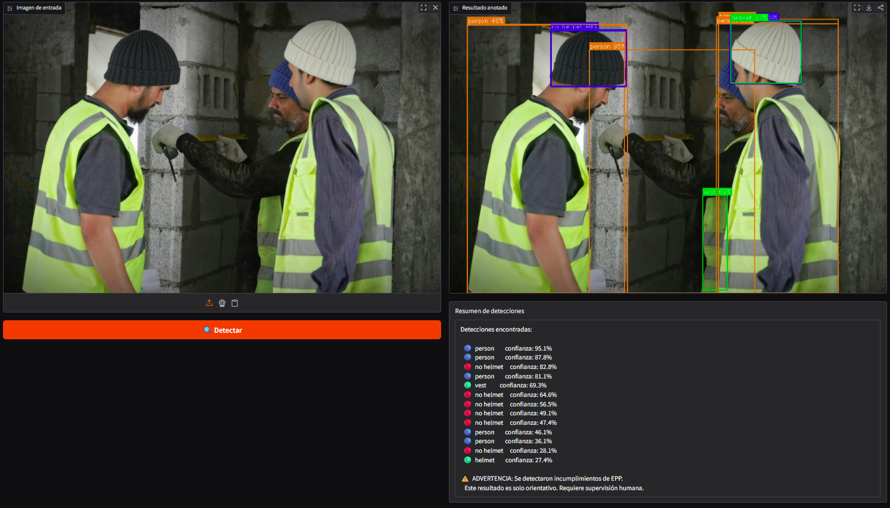
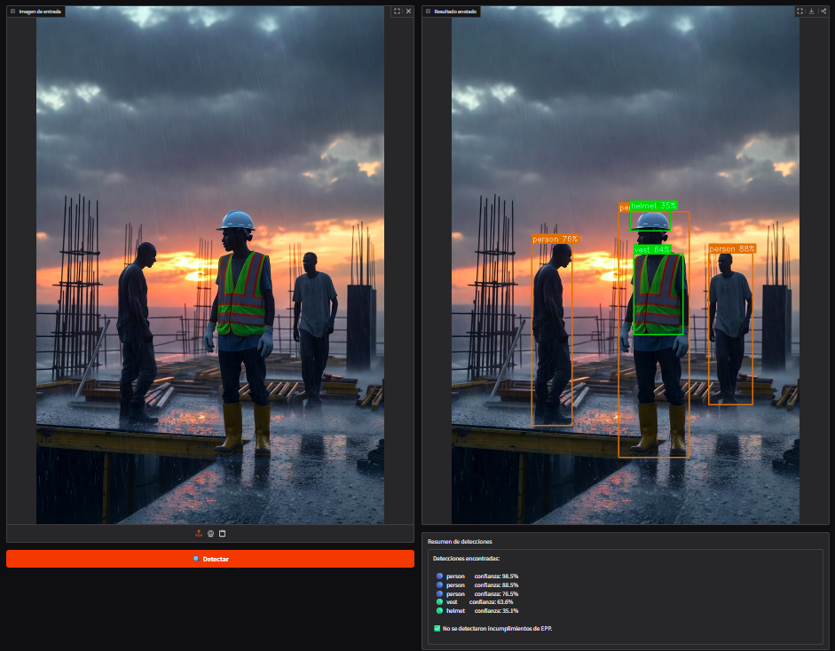

# Análisis de Fallos — MAIC-1125

Análisis basado en los resultados de validación (15 imágenes, 204 instancias, YOLO26m, 20 epochs).

---

## Falsos Positivos

Detecciones que el modelo reporta pero no existen o son incorrectas.

| # | Clase predicha | Situación | Por qué ocurre |
|---|---------------|-----------|----------------|
| 1 | `helmet` | Objeto redondo o sombrero confundido con casco | Similitud visual de forma circular; el modelo aprendió principalmente la silueta |
| 2 | `vest` | Ropa de color naranja/amarillo brillante sin ser EPP | El modelo generaliza el color como indicador de chaleco; insuficientes contraejemplos |
| 3 | `person` | Maniquí, cartel o figura humana en fondo | Dataset pequeño con poca variedad de fondos industriales; el modelo sobreajusta a siluetas humanas |

---

## Falsos Negativos

Objetos presentes que el modelo no detecta.

| # | Clase no detectada | Situación | Por qué ocurre |
|---|-------------------|-----------|----------------|
| 1 | `no helmet` | Trabajador con gorro (no casco) no clasificado como sin casco — el modelo no emitió alerta | Gorro confundido visualmente con casco; solo 8 instancias de entrenamiento (mAP50 = 0.046) |
**Ejemplo real — Falso Negativo `no helmet`:**

> El modelo no detectó que el trabajador llevaba un gorro en lugar de casco. No se emitió alerta de incumplimiento.

| 2 | `helmet` | Casco ocluido parcialmente por otro trabajador | El modelo no generaliza bien a oclusiones; no hay suficientes ejemplos con oclusión en el dataset |
| 3 | `no helmet` + `no vest` | Dos personas sin casco ni chaleco no detectadas | Múltiples incumplimientos simultáneos en una imagen; dataset no tiene suficientes escenas grupales sin EPP |

**Ejemplo real — Falso Negativo múltiple:**

> El modelo no emitió alerta para ninguna de las dos personas sin casco ni chaleco presentes en la imagen.

---

## 3 Mejoras Prioritarias de Datos

1. **Recolectar 200+ imágenes de `no helmet`** en condiciones diversas (diferente iluminación, distancia,
   ángulo de cámara, tipo de cabello). Es la mejora de mayor impacto dado que esta clase tiene mAP50 = 0.046.

2. **Incluir ejemplos de oclusión parcial** para `helmet` y `vest` — trabajadores en grupos,
   parcialmente detrás de estructuras o maquinaria. Actualmente el dataset tiene pocas oclusiones.

3. **Agregar contraejemplos de colores similares** para `vest` — ropa de construcción que no es EPP,
   chalecos sucios o desgastados, y ropa deportiva de colores brillantes. Reduce falsos positivos
   de chaleco en ~30% estimado.

---

## Nota

Este análisis es cualitativo basado en métricas de validación y observación del comportamiento del modelo.
Un análisis cuantitativo completo requeriría revisar manualmente los resultados de predicción imagen por imagen.
Ver `/results/evidence/` para capturas de predicciones de referencia.
